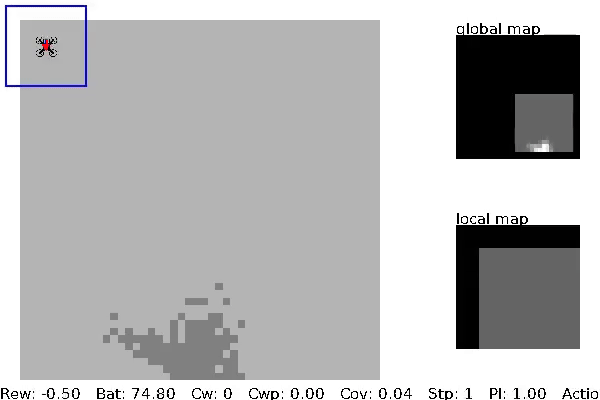

# Learning UAV-based path planning for efficient localization of objects using prior knowledge

> **Learning UAV-based path planning for efficient localization of objects using prior knowledge**\
> Rick van Essen, Eldert van Henten, and Gert Kootstra
> Paper: TODO

## About
Official implementation of the paper 'Learning UAV-based path planning for efficient localization of objects using prior knowledge'. It contains the simulation environment and the code to train and reproduce the results of the paper. 

## Installation
Python 3.10 or higher is needed with all dependencies listed in [`requirements.txt`](requirements.txt). Install using:
 
```commandline
pip install --upgrade pip
pip install -e .
```

Additionally, `Fields2Cover` is needed to calculate the baseline row-by-row flight path. See their [website](https://fields2cover.github.io/index.html) for installation instructions.

Alternatively, you can use the provided [dev container](.devcontainer).

## Usage

### Train RL agent
To train the RL agent, you need to define an experiment containing the simulation configuration and the training parameters. The [`experiments`](experiments/) folder contains the configuration files for the experiments done in the paper. Then use the bash script to train:

```commandline
./run_trainings <<experiment name>>
```

### Evaluate RL agent
To evaluate a trained RL agent, use the [evaluation script](evaluate.py). To reproduce the experiments done in the paper, run:

```commandline
./run_evaluations <<experiment name>>
```

Then use [`create_results_plots.ipynb`](create_results_plots.ipynb) to reproduce the plots.

### Play
To control the drone by keyboard, run:

```commandline
python3 -m drone_grid_env.utils.play
```

Use ASDW to move the drone 1 step in each direction and L to land the drone (when enabled in the configuration file).

## Citation
If you find this code usefull, please consider citing our paper:
```
@misc{essen2024,
    title = Learning UAV-based path planning for efficient localization of objects using prior knowledge,
    urldate = {2024-12-17},
    publisher = {arXiv},
    author = {van Essen, Rick and van Henten, Eldert and Kootstra, Gert},
    month = dec,
    year = {2024},
    note = {arXiv:TODO [cs]},
}
```
